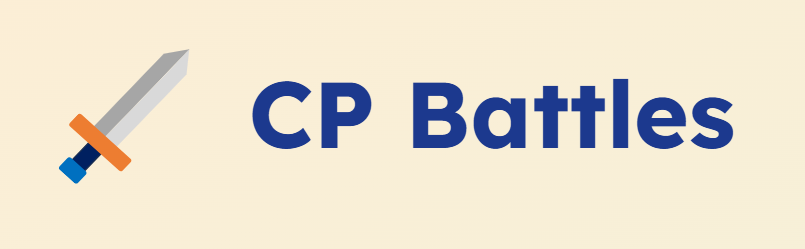

# CPBattles

<center></center>

## Description

A platform for competitive programming battles where players can create, join and compete in solving Codeforces problems. Problems are randomly selected from the Codeforces problemset and players must solve them within a time limit.

## Development

This project uses a Node.js backend and a React frontend. The backend is responsible for managing battles, users, and problem selection, while the frontend provides the user interface for players to interact with the platform. It requires two databases - one PostgreSQL database for main data storage, and one MongoDB database for managing scheduled tasks.

### Database

1. Set up a PostgreSQL database and a MongoDB database.
2. Create a database named `cpbattles` in PostgreSQL.
3. Run the SQL script located in `init.sql` to set up the initial database schema.

### Backend

1. Go to the `backend` directory.
2. Install dependencies:
   ```bash
   npm install
   ```
3. Copy the `.env.sample` file to `.env` and fill in the required environment variables.
4. Start the backend server:
   ```bash
   npm run dev # or npm run build && npm start
   ```

### Frontend

1. Go to the `frontend` directory.
2. Install dependencies:
   ```bash
   npm install
   ```
3. Fill in the `.env` file with the required environment variables.
4. Start the frontend server:
   ```bash
   npm run dev
   ```

## License

This project is licensed under the MIT License. See the [LICENSE](./LICENSE) file for details.
